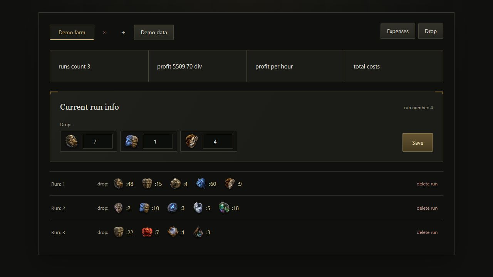
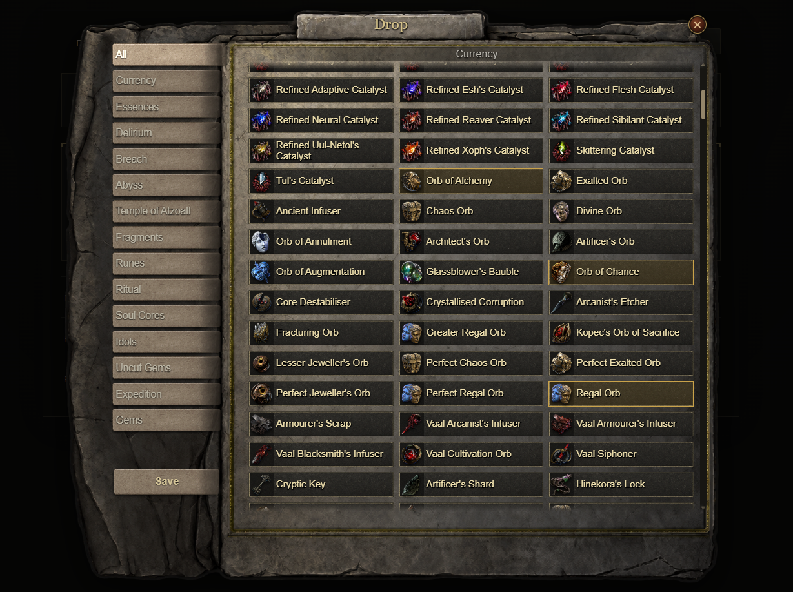

# PoE2 Farm Tracker

A learning project built with React for tracking farming runs in Path of Exile 2.

The goal is to help players track loot, expenses, and farming profitability in one place. The project is under active development.

## Preview




The screenshot shows sample data. The current `profit` summary displays total loot value; expense deductions and profit per hour are planned features.

## Implemented features

- Create, select, and delete farming sessions.
- Select dropped items and enter their quantities for each run.
- Calculate total loot value in Divine Orbs using price data from poe.ninja.
- Save and delete individual runs.
- Keep saved sessions and runs between page reloads using localStorage.
- Load a sample farming session with the **Demo data** button.

## Price data

The application currently uses 14 local JSON snapshots downloaded from the poe.ninja API. These files are updated manually using a separate script.

Saved runs store item quantities. Their displayed value is calculated using the price data included in the application, so updating that data can change the value of earlier runs.

## Running locally

Requires Node.js and npm.

Clone or download this repository, then run the following commands from the repository root:

```bash
cd my-react-app
npm install
npm run dev
```

Open the local URL shown in the terminal. Click **Demo data** to explore a sample farming session, or create your own session and select it to start adding runs.

Data is stored in the current browser. Clearing the site's local storage removes saved sessions.

## Updating price data

On Windows, run `update-poe2-api.bat` from the `my-react-app/src` folder. The script requires `curl.exe` and writes the downloaded JSON files to `my-react-app/src/ApiDataBase`.

Check the `LEAGUE` setting in the script before updating. If you use a production build, rebuild it after updating the JSON files to include the new prices.

Avoid repeatedly running the update script. PoE 2 price data refreshes roughly hourly, and excessive API usage may result in blocked access. See the [poe.ninja API usage guidelines](https://poe.ninja/docs/api).

## Planned features

- Track waystone and tablet expenses.
- Calculate net profit and estimated profit per hour.
- Filter items by category.
- Set custom item prices.
- Add the remaining nine item categories that require additional data handling: Unique Weapons, Unique Armours, Unique Accessories, Unique Flasks, Unique Charms, Unique Jewels, Unique Relics, Unique Tablets, and Precursor Tablets.
- Support resource-based farming metrics, such as loot value per Hive Blood spent.
